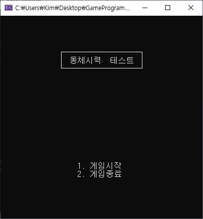

# Readme

## Version History

### [0.00.00] 2025-03-10 
### 프로젝트 생성 및 진입점 구현
- 게임 타이틀 제작
- 게임 설명문 헤더 및 소스 제작
- 콘솔 조정용 헤더 및 소스 제작 (텍스트 색상 변경 코드)
- 게임 Display 헤더 및 소스 제작 (방향 텍스트 및 방향 텍스트가 표시될 영역) 

### [0.01.01] 2025-03-11
- 콘솔 조정용 헤더 및 소스 수정 (커서 위치 변경 및 커서 숨기기 코드 적용)
- 게임 설명문 내용 수정 (난이도별 지연 시간, 체력 추가)
- 게임 콘솔 사이즈 수정
- 게임 방향 텍스트가 표시될 때의 지연 시간 구현
- 스코어 및 HP를 Display 소스에 추가
- 게임오버 구현

이미지

</img>

*이텔릭체*
**강조** 

표 생성
| 버그 리스트 | 기타 |
| --- | --- |

.인용문 작성
`textbox`
